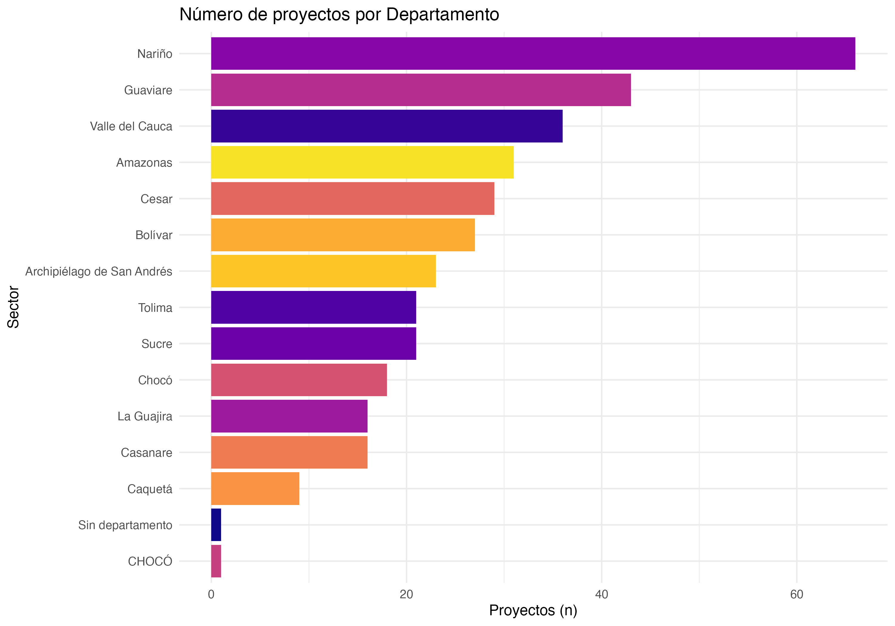
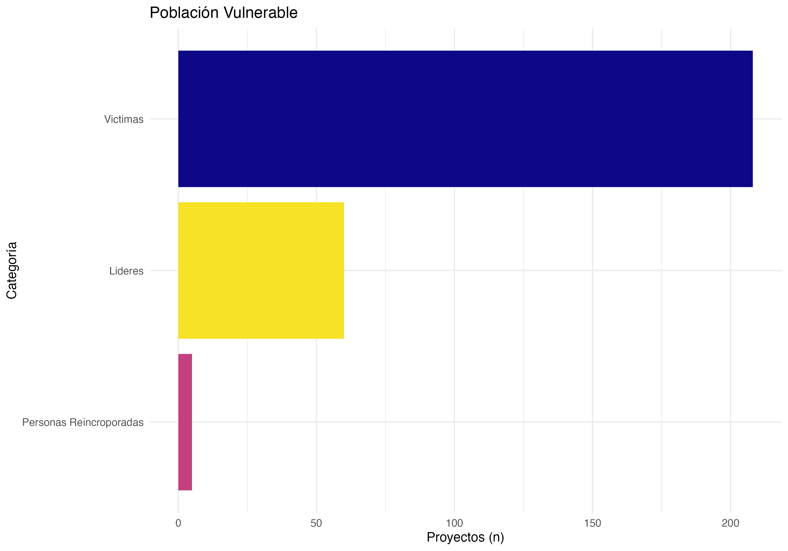
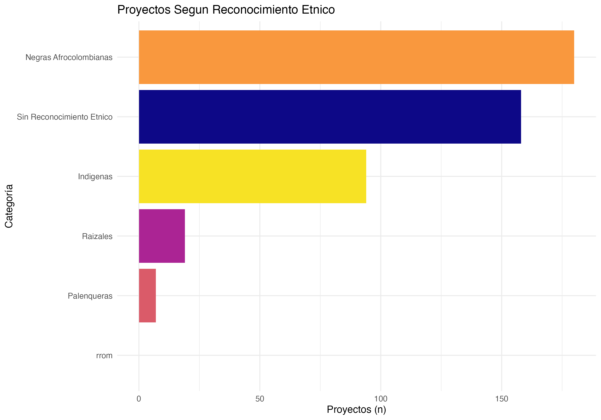
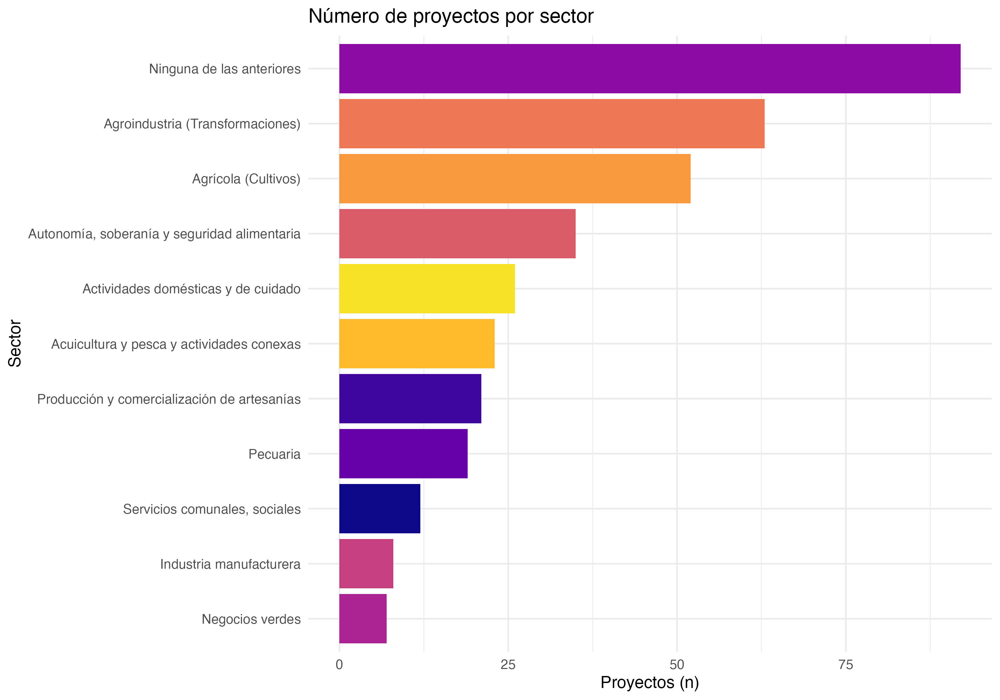
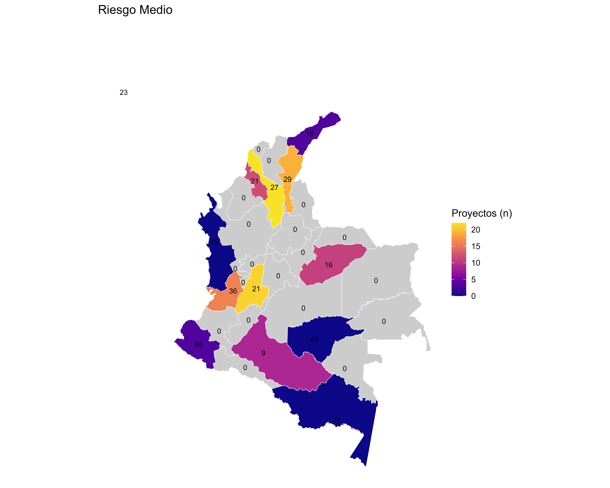

# Cultivating Equality: Rural Care Schools to Transform the Care Economy in Rural Colombia

## 1. Introduction

This section introduces the project, its objectives, and the relevance of the sampling process for the study.

## 2. Sample size

The sample size was determined using a cluster randomized controlled trial (RCT) design, accounting for covariates, unequal cluster sizes, and balanced treatment-control assignment. The following parameters were used:

- **Significance level:** 0.05  
- **Statistical power:** 0.80  
- **Intracluster correlation (ICC):** 0.01–0.40  
- **Average interviews per cluster (municipality):** 10, 15, 20, 25  
- **Variance reduction by covariates:** 0.30  
- **Cluster size variation (CV):** 0.20  
- **Treatment-control ratio:** 0.5  

The required number of clusters (municipalities) and households per municipality was calculated using the following formula:

```r
k_needed(MDE_target, m, icc, alpha, power, R2, CV, phi)
```

Where:
- `MDE_target` is the minimum detectable effect (e.g., 0.20 SD)
- `m` is the number of households per municipality (cluster)
- `icc` is the intracluster correlation
- `alpha` is the significance level
- `power` is the statistical power
- `R2` is the variance reduction by covariates
- `CV` is the coefficient of variation for cluster size
- `phi` is the proportion of clusters assigned to treatment

For example, with a target MDE of 0.20, 20 households per municipality, and ICC of 0.10, the required number of clusters is:

```r
k_needed(MDE_target = 0.20, m = 20, icc = 0.10, R2 = 0.30, CV = 0.20, phi = 0.5)
```

The results are summarized in the file [`code/02_samplingsize.R`](code/02_samplingsize.R) and the output table [`data/derived/size_continuous.xlsx`](data/derived/size_continuous.xlsx).

<p align="center">

</p>


## 3. Population of Study

The dataset comprises projects that were **rejected** by the Fondo Colombia Sostenible and therefore did not participate in any intervention activities. In total, there are **358 projects** included in the analysis. For each project, the following information is available:

[Code to reproduce](code/00_Descriptivas.R)

### Localization 

<p align="center">
  
  
</p>


### Number of persons by project

On average, each project has 20 persons involved. Median is 7. The maximum number of persons in a project is 813, while the minimum is 5.

<p align="center">
  
  
</p>

#### Characteristics of the participants


<p align="center">
    
    
    
    
</p>


### Sector (Organization type)




## 4. Potential Risk Factors for fieldwork

This matrix provides a comprehensive assessment of risks linked to interventions across municipalities. It combines geographic, contextual, and documentary evidence, enabling informed decision-making. By integrating quantitative indicators (such as risk levels and probabilities) with qualitative insights (including observations and source references), the matrix strengthens the evaluation process and supports a thorough understanding of potential risks prior to fieldwork. The design and methodology of this matrix are based on the experience and approach developed by Universidad de los Andes for the evaluation of Fondo Colombia Sostenible.

[See risk matrix](data/inputs/Matriz_riesgos_FOMUR.xlsx)
[Code to reproduce](code/01_Riesgo.R)

### Geographic Scope
- **Department**: Identifies the department (regional administrative unit).  
- **Municipality**: Specifies the local municipality.  
- **DANE Code**: The official geographic code used by Colombia’s National Statistics Department (DANE).  

### Risk Characterization
- **Type of Risk**: Defines the nature of the risk (e.g., security-related, socio-political, economic).  
- **Risk Level**: Classifies the intensity of the risk (e.g., Low, Medium, High).  
- **Risk Calculation**: Combines likelihood and severity to describe the risk (e.g., *Moderate and probable*, *Important and probable*).  

### Evidence and Triangulation
- **Observations**: Qualitative descriptions that contextualize the identified risks, including incidents or patterns.  
- **Source of Consultation**: References to external sources (e.g., news articles, institutional reports, governmental websites) used to validate the information.  
- **Triangulation Columns**: Additional fields capturing complementary evidence from other sources or perspectives (e.g., local press, community testimonies, security reports).  

### Contextual Analysis
- Some cells include notes about structural or persistent conditions (e.g., presence of illegal armed groups, economic activities sustaining risks).  
- This dimension helps differentiate between temporary events and chronic risk factors.  

<p align="center">



</p>


## 5. Flow of Project Selection and Randomization for Experimental Evaluation

This CONSORT diagram summarizes the process of selecting projects for inclusion in the experimental evaluation. Out of an initial pool of 358 projects, only those with sufficient localization information (N=357) were retained. Projects located in municipalities with high political or socioeconomic risk were excluded (n=168), leaving 189 projects with feasible implementation (classified as low risk = 73 and medium risk = 116).

From these, projects with fewer than 10 members were further excluded (n=91), resulting in 98 projects eligible by size. Additional restrictions applied to geographic representativeness: projects located in regions with very few comparable initiatives (Guajira = 1, Amazonas = 3, Nariño = 1, San Andrés = 3) were excluded (n=8). This left 90 projects situated in areas with the possibility of establishing a valid control group.

Within this final set, 25 projects were randomly assigned to the treatment group, while 25 matched projects served as the control group. To strengthen balance and account for potential attrition, 40 replacement projects were also identified.

<p align="center">

</p>

The spatial distribution of *Projects in regions with potential for valid control*, is the following.


## 6. Treatment and Control Groups Assigment

### Randomization Procedure to Treatment

The random allocation of projects to treatment was performed using a quota-based stratified random sampling procedure, ensuring proportional representation by department.

**Steps:**

1. **Quota Calculation:**  
	- The total number of projects to be assigned (N = 25) was distributed across departments according to the proportion of available projects in each department.
	- Quotas were calculated by multiplying the department's proportion by N, rounding down, and distributing any remaining slots to departments with the largest fractional remainder.
	- This guarantees that the sample matches the departmental distribution as closely as possible.

2. **Random Sampling:**  
	- A random sample of N projects was drawn from the eligible pool.
	- The sample was validated to ensure it matched the calculated quotas for each department.
	- If a valid sample was not found after 10,000 iterations, a backup stratified sample was generated by randomly selecting the required number of projects per department.

3. **Output:**  
	- The final sample and quotas were saved to Excel files for documentation and reproducibility.
	- The selected sample was also saved in R data format for further analysis.

**Code Reference:**  
See [`code/03_sample.R`](code/03_sample.R) and output files [`data/derived/sample_25_by_departamento_RANDOM.xlsx`](data/derived/sample_25_by_departamento_RANDOM.xlsx) and [`data/derived/selected_sample.xlsx`](data/derived/selected_sample.xlsx).

### Matching Procedure to Assigment Control

The selection of valid control projects was performed using a Propensity Score Matching (PSM) procedure at the project level. This approach ensures that control projects are statistically similar to treated projects based on key observable characteristics.

**Variables used for Propensity Score Matching:**

- Sector of productive activity
- Total number of persons in the project
- Percentage of participants with gay orientation
- Percentage of indigenous participants
- Percentage of participants in SISBEN A
- Percentage of participants in SISBEN B

These variables were selected to capture relevant demographic, socioeconomic, and sectoral differences between projects, improving the comparability between treated and control groups.

**Steps:**

1. **Data Preparation:**  
	- Projects were classified as treated or control based on random assignment.
	- Relevant variables for matching included sector, total persons, percentage of gay orientation, percentage of indigenous participants, and SISBEN categories, among others.
	- Missing values were imputed with zeros or default categories to ensure completeness.

2. **Propensity Score Estimation:**  
	- A logistic regression model was fitted to estimate the probability of being assigned to treatment, using the selected covariates.

3. **Matching:**  
	- Nearest neighbor matching (1:1, without replacement, caliper 0.2) was performed using the estimated propensity scores.
	- This procedure pairs each treated project with a control project that has a similar propensity score, improving balance between groups.

4. **Output:**  
	- The matched dataset, including treated and control projects and their pairs, was exported to Excel for documentation and further analysis.

**Code Reference:**  
See [`code/04_match.R`](code/04_match.R) and output file [`data/derived/matched_projects_Data3.xlsx`](data/derived/matched_projects_Data3.xlsx).

## Final Sample Summary

The final samples is available in the output file [`data/derived/Escuelas_Cuidado_2025-09-10.xlsx`](data/derived/Escuelas_Cuidado_2025-09-10.xlsx).

### 

<p align="center">

</p>


### Summary statistics by group (Treated vs Control)


| Label                        | Treated_n | Treated_mean | Treated_sd | Control_n | Control_mean | Control_sd | Significance |
|:-----------------------------|----------:|-------------:|-----------:|----------:|-------------:|-----------:|:------------:|
| % Women in Organization      |        25 |        99.07 |       3.33 |        25 |        95.07 |      20.12 |              |
| % Transgender Women          |        25 |         0.10 |       0.50 |        25 |         0.00 |       0.00 |              |
| % Other Gender               |         7 |         0.00 |       0.00 |         9 |         0.74 |       2.22 |              |
| Total Persons                |        25 |        35.80 |      42.31 |        25 |        23.64 |      11.43 |              |
| % Heterosexual Orientation   |        25 |        94.40 |      20.36 |        25 |        99.07 |       3.54 |              |
| % Gay Orientation            |        25 |         0.39 |       1.40 |        25 |         0.27 |       1.33 |              |
| % Bisexual Orientation       |        25 |         0.00 |       0.00 |        25 |         0.00 |       0.00 |              |
| % Other Sexual Orientation   |         7 |         0.00 |       0.00 |         8 |         0.00 |       0.00 |              |
| % No Info Sexual Orientation |         7 |         4.34 |       8.53 |         9 |         1.85 |       5.56 |              |
| % Aged 18-28                 |        25 |        26.69 |      28.20 |        25 |        20.44 |      25.51 |              |
| % Aged 60+                   |        25 |        20.01 |      17.88 |        25 |        13.68 |      13.91 |              |
| % Indigenous                 |        25 |        23.81 |      37.05 |        25 |        21.50 |      40.27 |              |
| % Rrom                       |        25 |         0.00 |       0.00 |        25 |         0.00 |       0.00 |              |
| % Raizales                   |        25 |         0.00 |       0.00 |        25 |         0.00 |       0.00 |              |
| % Palenqueras                |        25 |         0.00 |       0.00 |        25 |         0.00 |       0.00 |              |
| % Black/Afrocolombian        |        25 |        15.17 |      31.42 |        25 |        12.14 |      33.12 |              |
| % No Ethnic Recognition      |        25 |        61.02 |      41.34 |        25 |        66.35 |      46.65 |              |
| % Total Ethnic Size          |        25 |       100.00 |       0.00 |        25 |       100.00 |       0.00 |              |
| % SISBEN A                   |        25 |        66.29 |      21.70 |        25 |        66.63 |      28.36 |              |
| % SISBEN B                   |        25 |        23.57 |      16.66 |        25 |        23.97 |      20.82 |              |
| % SISBEN C                   |        25 |         4.24 |       7.89 |        25 |         8.01 |      11.15 |              |
| % SISBEN D                   |        25 |         0.15 |       0.74 |        25 |         0.27 |       1.33 |              |
| % Reincorporated             |        25 |         0.72 |       3.50 |        25 |         0.00 |       0.00 |              |
| % Leaders                    |        25 |         2.53 |       5.48 |        25 |        14.01 |      32.75 | *            |
| % Victims                    |        25 |        33.30 |      38.02 |        25 |        27.60 |      38.38 |              |

**Notes:**  
- *Rrom*: Refers to the Romani ethnic group in Colombia.  
- *Raizales*: Refers to the Afro-Caribbean ethnic group native to the San Andrés and Providencia islands.  
- *Palenqueras*: Refers to women from San Basilio de Palenque, a historic Afro-Colombian community.  
- *Afrocolombian*: Refers to people of African descent in Colombia.  
- *SISBEN*: The Colombian government’s system for identifying and classifying households for social program eligibility (Socioeconomic Identification System).


---
*Prepared by: Laura Quintero and Juan Carlos Muñoz-Mora*  
*Date: 2025 - Sept*